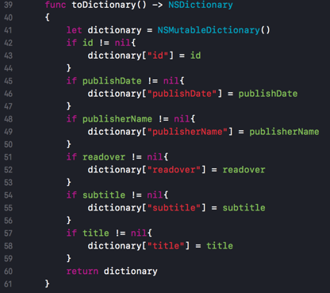
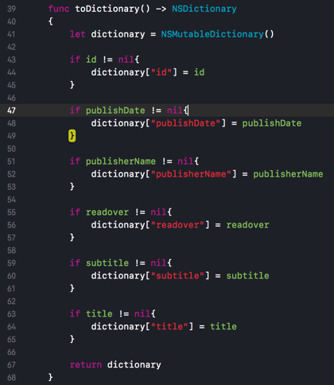
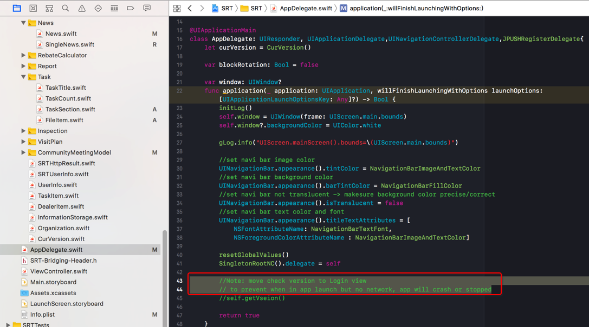
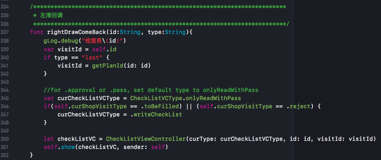
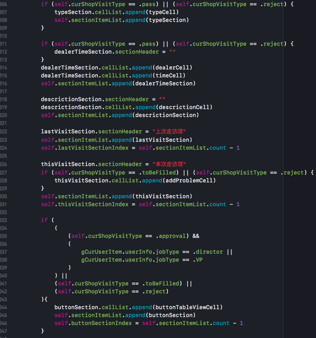
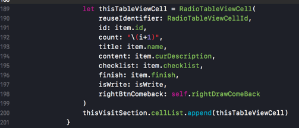

# 不好和好的风格的举例

那么如何才算有好的代码风格和习惯呢？

接下来就来通过举例来具体说明。

前面提到了，好的风格和习惯主要指的是**见名知意**

那么如何才能实现见名知意？

即：如何给变量，函数，参数，类等等命名？

## 举例：不好的做法 -> 好的做法

### 变量名应该体现出所属类的中所要代表的含义
卓越一线中有几个大功能模板：
* 报表
* 任务
  * 售前店访
  * 店头点检
  * 小区例会
* 通知

在售前店访模块中，实现一个tableView中的一个section的item时，使用了`CurSectionItem`

-> 从这个名字看出是，其所想要表达的含义是：当前的section的item

-> 以及和使用范围是：（以为是）当前的售前店访的专用的Section的item呢

-> 而实际上这个CurSectionItem是整个任务模块通用的

-> 所以，这个不是好的做法

-> 应该改为：

符合此处代码的原意：整个任务模块的所有页面的通用的TableView中用到的Section的item

-> 所以，此处可以改名为，类似于：`TaskTableViewSectionItem`

-> 当然，考虑到名字有点长，想要缩短，且又不会失去本身的含义，不会和其他代码有冲突

-> 可以改为：`TaskTVSectionItem`=task的tableview的sectionItem

-> TaskSectionItem=task的（所有页面通用的，只有tableview中才会有的section这个概念）的item

### 加上必要的换行

```swift
    func toDictionary() -> NSDictionary
    {
        let dictionary = NSMutableDictionary()
        if id != nil{
            dictionary["id"] = id
        }
        if publishDate != nil{
            dictionary["publishDate"] = publishDate
        }
        if publisherName != nil{
            dictionary["publisherName"] = publisherName
        }
        if readover != nil{
            dictionary["readover"] = readover
        }
        if subtitle != nil{
            dictionary["subtitle"] = subtitle
        }
        if title != nil{
            dictionary["title"] = title
        }
        return dictionary
    }
```



问题：

每个if后面，没有适当的换行

-> 容易让看代码的人误以为是`if else`的写法，是一体的呢

-> 实际上此处是独立的多个if判断。

```swift
    func toDictionary() -> NSDictionary
    {
        let dictionary = NSMutableDictionary()
        
        if id != nil{
            dictionary["id"] = id
        }
        
        if publishDate != nil{
            dictionary["publishDate"] = publishDate
        }
        
        if publisherName != nil{
            dictionary["publisherName"] = publisherName
        }
        
        if readover != nil{
            dictionary["readover"] = readover
        }
        
        if subtitle != nil{
            dictionary["subtitle"] = subtitle
        }
        
        if title != nil{
            dictionary["title"] = title
        }
        
        return dictionary
    }
```



### 去除多余的注释

代码本身如果可以说明其自身含义，就无需再加上，画蛇添足的，多余的注释了。

TODO： 加上例子说明

对此多说几句：

之前我们被教导说，写代码，一定要加上注释。并且好像注释写的越多，代码质量就越高似的。

而实际上：

后来遇到一个来自`Oracle`的前同事，得知Oracle公司内，要求写代码时，一定要去掉多余的注释，不允许有任何多余的注释。

如果非要在代码中加注释，则需要提交申请才可以的。

其背后逻辑很简单：

如果你的代码本身的逻辑已经很清楚，且各种变量函数命名很清楚，总体代码质量很高，则就不需要加上额外的多余的注释。

如果非要加上注释，也是不得已的情况，比如：
* 业务逻辑特殊，需要加注释去解释清楚
* 由于各种算法，使用场景的特殊性，代码本身没法反应出来，需要额外加注释说明

对此做法我也比较赞同，总结来说就是：

**除非不得已，否则不需要的多余注释。而应该把更多精力花在构思良好的架构和见名知意的变量函数的命名上，如此可以大幅提高代码质量**

### 加上必要的注释

什么叫必要的注释？

如上面所述：代码本身没法体现出的逻辑、背景、特殊情况等内容，都要加上必要的注释和说明

举例如下：

如图：



背景是：

卓越一线中iOS中的AppDelegate.swift的AppDelegate中，

则部分是app启动时会执行的代码

此处把之前用于检测新版本的代码注释掉了：

`//self.getVseion()`

但是却没有加上合适的说明：

通过询问才了解到：

此处注释掉的原因是：

如果app启动时，用户当前时没有网络的，则此处获取版本就会死掉，导致程序卡死

所以才注释掉

-》所以，此处本身代码只有一行：

`//self.getVseion()`

是看不出来这个背后的逻辑的，所以才要加上必要的注释：
```swift
        //Note: move check version to Login view
        // to prevent when in app launch but no network, app will crash or stopped
        //self.getVseion()
```

-》并且，此处也不应该直接删除掉

`//self.getVseion()`

这行代码

-》否则后续的维护人员（包括自己时间长回来看自己代码）就会不知道这个本该需要注意的逻辑。

### 去除和合并冗余的代码
写代码有个逻辑

`less is more`

更少的代码（如果能够实现同样的功能，且逻辑清楚的情况下）可以带来更多的（好处，比如代码简洁易懂，质量更高，更易于维护，更不容易出错等等）

如果某些代码，在多个地方（ >= 2次）被用到，则一般来说，都应该提取出来写成公共的代码（函数，库，类）

比如：

对于已知的定义：
```swift
enum CheckListVCType{
    case writeCheckList //填写检查表
    case onlyRead       //查看检查表
    case onlyReadWithPass  //查看检查表
}

enum ShopVisitType{
    case toBeFilled //待填写
    case reject //驳回
    case pass //通过
    case approval //待审批
}
```

#### 多个判断条件可以被整合优化
来说，如下的代码：

```swift
func rightDrawComeBack(id:String,type:String){
    gLog.debug("检查表\(id)")
    var visitId = self.id
    if type == "last"{
        visitId = getPlanId(id: id)
    }
    
    if self.curShopVisitType == .approval{
        dispatchMain_async({
            let CheckListVC = CheckListViewController(curType: .onlyReadWithPass, id: id, visitId: visitId)
            self.show(CheckListVC, sender: self)
        })
    }else if(self.curShopVisitType == .toBeFilled){
        dispatchMain_async({
            let CheckListVC = CheckListViewController(curType: .writeCheckList, id: id, visitId: visitId)
            self.show(CheckListVC, sender: self)
        })
    }else if (self.curShopVisitType == .pass){
    
        dispatchMain_async({
            let CheckListVC = CheckListViewController(curType: .onlyReadWithPass, id: id, visitId: visitId)
            self.show(CheckListVC, sender: self)
        })
    }else if(self.curShopVisitType == .reject){
        dispatchMain_async({
            let CheckListVC = CheckListViewController(curType: .writeCheckList, id: id, visitId: visitId)
            self.show(CheckListVC, sender: self)
        })
    }
}
```

对于`curShopVisitType`的所有的4种可能都判断了，且每部分的代码都是一样的，就显得很冗余和啰嗦

相关部分应该改为：
```swift
    var curCheckListVCType = CheckListVCType.onlyReadWithPass
    if (self.curShopVisitType == .approval) || (self.curShopVisitType == .pass) {
        curCheckListVCType = .onlyReadWithPass
    } else if(self.curShopVisitType == .toBeFilled) || (self.curShopVisitType == .reject) {
        curCheckListVCType = .writeCheckList
    }

    let checkListVC = CheckListViewController(curType: curCheckListVCType, id: id, visitId: visitId)
    self.show(checkListVC, sender: self)
```

或者、甚至：
```swift
    //for .approval or .pass, set default type to onlyReadWithPass
    var curCheckListVCType = CheckListVCType.onlyReadWithPass
    if(self.curShopVisitType == .toBeFilled) || (self.curShopVisitType == .reject) {
        curCheckListVCType = .writeCheckList
    }

    let checkListVC = CheckListViewController(curType: curCheckListVCType, id: id, visitId: visitId)
    self.show(checkListVC, sender: self)
```



都可以。

-> 如此改动，逻辑就清楚多了，代码也更不容易出错。


#### 多分支中代码重复应该被合并

这些代码：
```swift
    switch self.curShopVisitType {
    case .approval:
        dealerTimeSection.cellList.append(dealerCell)
        dealerTimeSection.cellList.append(timeCell)
        self.sectionItemList.append(dealerTimeSection)
        
        descrictionSection.sectionHeader = ""
        descrictionSection.cellList.append(descrictionCell)
        self.sectionItemList.append(descrictionSection)
        
        lastVisitSection.sectionHeader = "上次走访项"
        self.sectionItemList.append(lastVisitSection)
        self.lastVisitSectionIndex = self.sectionItemList.count - 1

        thisVisitSection.sectionHeader = "本次走访项"
        self.sectionItemList.append(thisVisitSection)
        self.thisVisitSectionIndex = self.sectionItemList.count - 1
        
        if (gCurUserItem.userInfo.jobType == .director || gCurUserItem.userInfo.jobType == .VP){
            buttonSection.cellList.append(buttonTableViewCell)
            self.sectionItemList.append(buttonSection)
            self.buttonSectionIndex = self.sectionItemList.count - 1
        }

    case .toBeFilled:
        dealerTimeSection.cellList.append(dealerCell)
        dealerTimeSection.cellList.append(timeCell)
        self.sectionItemList.append(dealerTimeSection)
        
        descrictionSection.sectionHeader = ""
        descrictionSection.cellList.append(descrictionCell)
        self.sectionItemList.append(descrictionSection)
        
        lastVisitSection.sectionHeader = "上次走访项"
        self.sectionItemList.append(lastVisitSection)
        self.lastVisitSectionIndex = self.sectionItemList.count - 1

        thisVisitSection.sectionHeader = "本次走访项"
        thisVisitSection.cellList.append(addProblemCell)
        self.sectionItemList.append(thisVisitSection)
        self.thisVisitSectionIndex = self.sectionItemList.count - 1

        buttonSection.cellList.append(buttonTableViewCell)
        self.sectionItemList.append(buttonSection)
        self.buttonSectionIndex = self.sectionItemList.count - 1

    case .pass:
        typeSection.cellList.append(typeCell)
        self.sectionItemList.append(typeSection)
        
        dealerTimeSection.sectionHeader = ""
        dealerTimeSection.cellList.append(dealerCell)
        dealerTimeSection.cellList.append(timeCell)
        self.sectionItemList.append(dealerTimeSection)
        
        descrictionSection.sectionHeader = ""
        descrictionSection.cellList.append(descrictionCell)
        self.sectionItemList.append(descrictionSection)
        
        lastVisitSection.sectionHeader = "上次走访项"
        self.sectionItemList.append(lastVisitSection)
        self.lastVisitSectionIndex = self.sectionItemList.count - 1

        thisVisitSection.sectionHeader = "本次走访项"
        self.sectionItemList.append(thisVisitSection)
        self.thisVisitSectionIndex = self.sectionItemList.count - 1

    case .reject:
        typeSection.cellList.append(typeCell)
        self.sectionItemList.append(typeSection)
        
        dealerTimeSection.sectionHeader = ""
        dealerTimeSection.cellList.append(dealerCell)
        dealerTimeSection.cellList.append(timeCell)
        self.sectionItemList.append(dealerTimeSection)
        
        descrictionSection.sectionHeader = ""
        descrictionSection.cellList.append(descrictionCell)
        self.sectionItemList.append(descrictionSection)
        
        lastVisitSection.sectionHeader = "上次走访项"
        self.sectionItemList.append(lastVisitSection)
        self.lastVisitSectionIndex = self.sectionItemList.count - 1

        thisVisitSection.sectionHeader = "本次走访项"
        thisVisitSection.cellList.append(addProblemCell)
        self.sectionItemList.append(thisVisitSection)
        self.thisVisitSectionIndex = self.sectionItemList.count - 1

        buttonSection.cellList.append(buttonTableViewCell)
        self.sectionItemList.append(buttonSection)
        self.buttonSectionIndex = self.sectionItemList.count - 1
    }
```

改为：

```swift
    if (self.curShopVisitType == .pass) || (self.curShopVisitType == .reject) {
        typeSection.cellList.append(typeCell)
        self.sectionItemList.append(typeSection)
    }

    if (self.curShopVisitType == .pass) || (self.curShopVisitType == .reject) {
        dealerTimeSection.sectionHeader = ""
    }
    dealerTimeSection.cellList.append(dealerCell)
    dealerTimeSection.cellList.append(timeCell)
    self.sectionItemList.append(dealerTimeSection)
    
    descrictionSection.sectionHeader = ""
    descrictionSection.cellList.append(descrictionCell)
    self.sectionItemList.append(descrictionSection)
    
    lastVisitSection.sectionHeader = "上次走访项"
    self.sectionItemList.append(lastVisitSection)
    self.lastVisitSectionIndex = self.sectionItemList.count - 1
    
    thisVisitSection.sectionHeader = "本次走访项"
    if (self.curShopVisitType == .toBeFilled) || (self.curShopVisitType == .reject) {
        thisVisitSection.cellList.append(addProblemCell)
    }
    self.sectionItemList.append(thisVisitSection)
    self.thisVisitSectionIndex = self.sectionItemList.count - 1
    
    if (
        (
            (self.curShopVisitType == .approval) &&
            (
                gCurUserItem.userInfo.jobType == .director ||
                gCurUserItem.userInfo.jobType == .VP
            )
        ) ||
        (self.curShopVisitType == .toBeFilled) ||
        (self.curShopVisitType == .reject)
    ){
        buttonSection.cellList.append(buttonTableViewCell)
        self.sectionItemList.append(buttonSection)
        self.buttonSectionIndex = self.sectionItemList.count - 1
    }
```



### 当传递函数参数太多时，加上适当的换行，以提高代码可读性

对于调用函数参数太多时：
```swift
let thisTableViewCell = RadioTableViewCell(reuseIdentifier: RadioTableViewCellId, id: item.id,count:"\(i+1)",title: item.name, content: item.curDescription, checklist: item.checklist, finish:item.finish, isWrite:isWrite,rightBtnComeback: self.rightDrawComeBack)
thisVisitSection.cellList.append(thisTableViewCell)
```

应该给每个参数加上合适的换行，提高代码可读性：
```swift
let thisTableViewCell = RadioTableViewCell(
    reuseIdentifier: RadioTableViewCellId,
    id: item.id,
    count: "\(i+1)",
    title: item.name,
    content: item.curDescription,
    checklist: item.checklist,
    finish: item.finish,
    isWrite: isWrite,
    rightBtnComeback: self.rightDrawComeBack
)
thisVisitSection.cellList.append(thisTableViewCell)
```



使得能看清楚具体的参数名和参数值。
